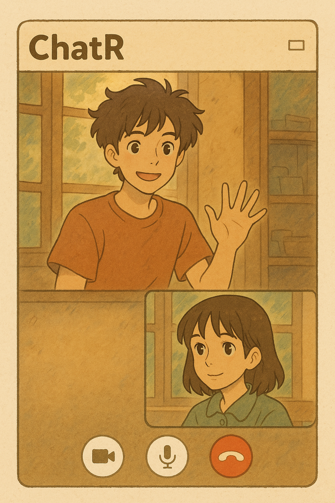
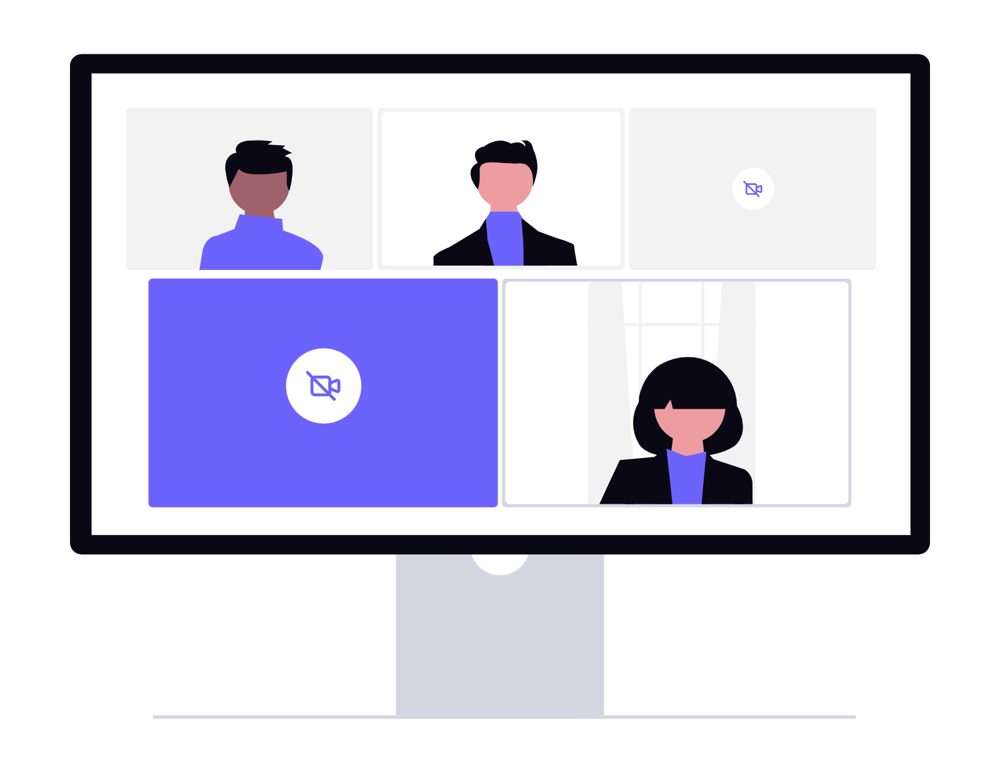

# Confera - Video Chat Application

Confera is a full-stack video chat application that allows users to connect with others through real-time video, audio, and chat. It features a modern, clean interface and is built with a powerful stack of technologies including React, Node.js, and WebRTC.

## Features

- **User Authentication**: Secure user registration and login system.
- **Real-time Video/Audio**: High-quality, real-time video and audio communication using WebRTC.
- **Screen Sharing**: Share your screen with other participants in the meeting.
- **Text Chat**: A built-in chat feature for real-time messaging during video calls.
- **Meeting History**: View a history of your past meetings and rejoin them with a single click.
- **Responsive Design**: A modern and responsive user interface built with Material-UI.

---

## Tech Stack

| Category     | Technology                                                     |
|--------------|----------------------------------------------------------------|
| **Frontend** | React, React Router, Material-UI, Socket.IO Client, Axios, Vite |
| **Backend** | Node.js, Express, MongoDB, Mongoose, Socket.IO, JWT, bcrypt     |
| **Database** | MongoDB                                                        |

---

## Getting Started

To get a local copy up and running, follow these simple steps.

### Prerequisites

- Node.js and npm installed on your machine.
- A running instance of MongoDB.

### Installation & Setup

1.  **Clone the repo**
    ```sh
    git clone [https://github.com/MHasan1234/VideoChatApp.git](https://github.com/MHasan1234/VideoChatApp.git)
    ```
2.  **Navigate to the project directory**
    ```sh
    cd VideoChatApp
    ```
3.  **Install Backend Dependencies**
    ```sh
    cd backend
    npm install
    ```
4.  **Install Frontend Dependencies**
    ```sh
    cd ../frontend
    npm install
    ```
5.  **Configure Environment Variables**
    In the `backend` directory, create a `.env` file and add the following variables. Replace the placeholder values with your actual data.
    ```env
    MONGO_URI=your_mongodb_connection_string
    JWT_SECRET=your_super_secret_jwt_key
    PORT=8000
    ```

---

## Running the Application

1.  **Start the Backend Server**
    From the `backend` directory, run:
    ```sh
    npm run dev
    ```
2.  **Start the Frontend Development Server**
    From the `frontend` directory, run:
    ```sh
    npm run dev
    ```
The application will be available at `http://localhost:5173` (or another port if 5173 is in use).

---

## Screenshots

<p align="center">
  
  
  
</p>

---
Screenshots
<p align="center">


</p>
